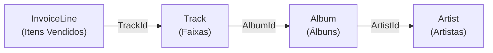

# REFORÇO PRÁTICO DE CONSULTAS ENTRE CHAVES

A consulta realizada abaixo passa por 4 tabelas distintas e serve para demonstrar como cada tabela é conectada com outra. Em resumo, esta consulta busca e exibe o nome dos primeiros 10 artistas que possuem músicas vendidas (registradas na tabela de itens de fatura `InvoiceLine`)

Para entender o funcionamento, a leitura deve ser feita de dentro para fora (das subconsultas internas para a principal)

**Fluxo de conectividade:** 


**NOTA:** Observe a cláusula `IN` na consulta abaixo. Ela funciona como uma forma simplificada de testar **múltiplas opções de uma só vez**. Enquanto o operador `=` compara o campo com um **único valor específico** (`coluna = 1`), o `IN` verifica se o campo atende a qualquer um dos valores contidos na lista (`coluna IN (1, 2, 3)`)

```sql
SELECT Name FROM Artist WHERE ArtistId IN (
    SELECT ArtistId FROM Album WHERE AlbumId IN (
        SELECT AlbumId FROM Track WHERE TrackId IN (
            SELECT TrackId FROM InvoiceLine
        )
    )
) LIMIT 10;
```

**Saída:**
| Name |
|---|
| AC/DC |
| Accept |
| Aerosmith |
| Alanis Morissette |
| Alice In Chains |
| Antônio Carlos Jobim |
| Apocalyptica |
| Audioslave |
| BackBeat |
| Billy Cobham |