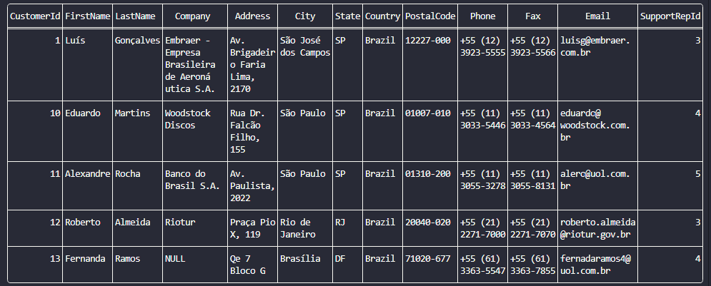

# Filtrando linhas com WHERE

A cláusula `WHERE` é usada para filtrar linha em uma consulta SQL. Assim, ela define uma condição que deve ser satisfeita para que uma linha seja retornada. No exemplo abaixo selecionaremos a tabela `Customer` e filtraremos as linhas para que retorne somente clientes em que na coluna `Country` esteja `Brazil`

```sql
SELECT * FROM Customer WHERE Country = 'Brazil';
```

**Saída:**

